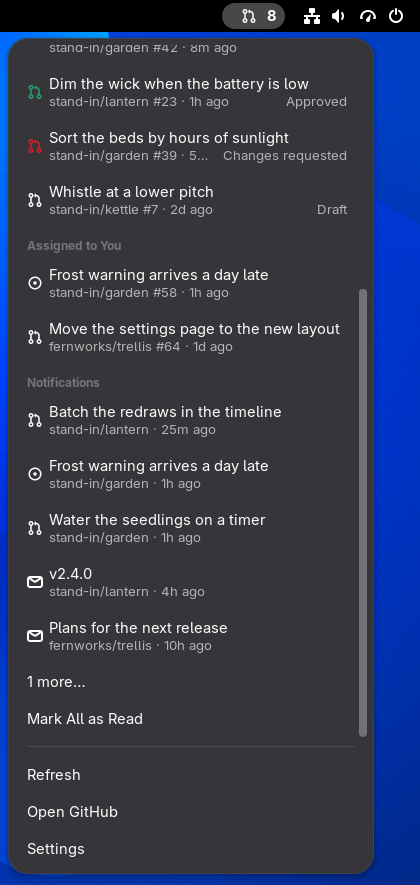
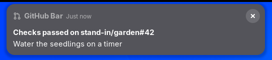
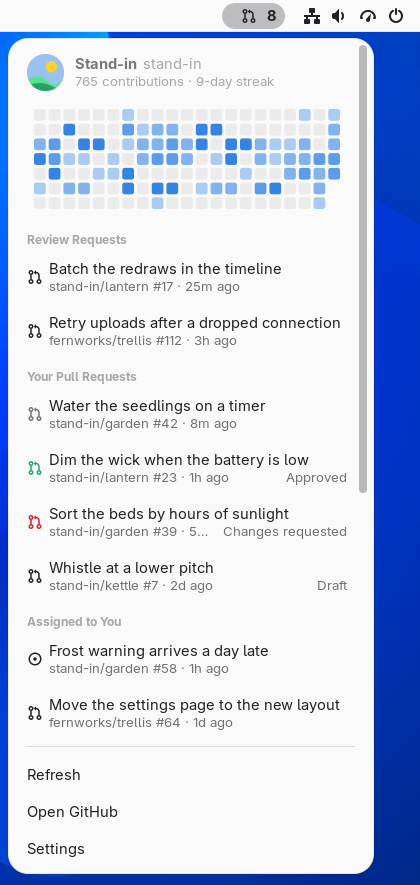
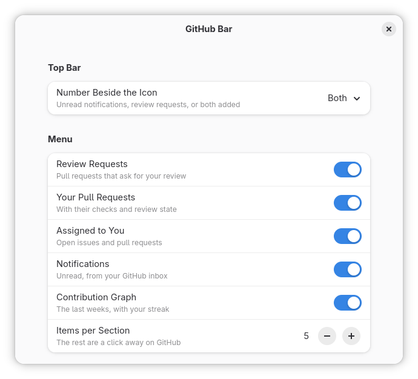
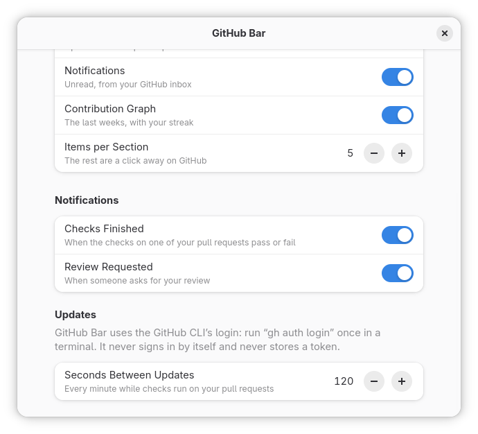

# GitHub Bar

Your GitHub notifications, review requests and pull request CI status in the top bar of
GNOME Shell.


## What it does

- **A count in the top bar**: unread notifications and review requests, added together,
  or either alone, or none.
- **Review requests**: open pull requests that ask for your review.
- **Your pull requests**: each with its checks (running, passed, failed) and review state.
- **Assigned to you and notifications**: open issues and pull requests assigned to you,
  and your unread GitHub notifications; a click opens one and marks it read.
- **Your contributions**: the last weeks of your calendar, in the accent colour, with your
  streak.
- **Notifications on your desktop** when the checks on one of your pull requests finish,
  and when someone asks for your review.






It follows the light and dark styles:



## Requirements

GNOME Shell 50, libsecret's GObject introspection data (installed with GNOME on most
distributions), and the [GitHub CLI](https://cli.github.com/) signed in once:

```bash
gh auth login
```

GitHub Bar uses that login. It never signs anyone in, never stores a token of its own,
and never refreshes one: sign out with `gh auth logout` and it shows that you are signed
out.

## Privacy and network

It talks only to `api.github.com` (and GitHub's avatar server, for your picture), with the
GitHub CLI's token, read fresh from the keyring (or gh's `hosts.yml`) each time and never
kept. It reads your notifications, your open pull requests and issues and your
contribution calendar. The only things it changes are notifications you mark read. It
stores your avatar under `~/.cache/github-bar@jackicus/`. Nothing is sent anywhere else,
and nothing is logged but failures.

It reads up to 100 unread notifications. It asks once every two minutes (you can choose),
every minute while checks run on your pull requests, and never sooner than GitHub's own
poll interval. It skips while the session has been idle for ten minutes. One update costs
a single point of GitHub's GraphQL rate limit, and an unchanged inbox costs none.

## Install

From source:

```bash
git clone https://github.com/Jackicus/GNOME-GitHub-Bar.git
cd GNOME-GitHub-Bar
make install
```

Then log out and back in (on Wayland the shell only finds a new extension at login), and
turn it on:

```bash
gnome-extensions enable github-bar@jackicus
```

To update, `git pull && make install`, then log out and in. To remove it, `make uninstall`.

## Preferences

`gnome-extensions prefs github-bar@jackicus` opens them, as does Settings at the foot of the
menu.

| | |
|---|---|
|  |  |

- **Number Beside the Icon**: unread notifications, review requests, both added, or none.
- **Menu**: each section on or off, and how many items each lists.
- **Notifications**: when checks finish, when your review is requested.
- **Seconds Between Updates**: 60 to 3600.

## Troubleshooting

"Sign in with gh auth login" while you are signed in: GitHub Bar looks for gh's login in
the keyring (the default) or in `~/.config/gh/hosts.yml`. A locked keyring reads as signed
out until it is unlocked.

The extension's messages are in the shell's journal, and the preferences' in their own
process's:

```bash
journalctl -f -o cat /usr/bin/gnome-shell | grep -i 'github bar'
journalctl -f -o cat SYSLOG_IDENTIFIER=org.gnome.Shell.Extensions
```

From a clone, `make status` says whether it is installed and running, and `make logs`
follows its lines. Include them in a bug report.

## Development

`make link` installs it as a link to `src/`, `make reload` loads your edits, `make check`
is what CI runs, and `make shots` retakes the screenshots. See
[CONTRIBUTING.md](CONTRIBUTING.md), and [CLAUDE.md](CLAUDE.md) for the design.

## Licence

GPL-2.0-or-later. See [LICENSE](LICENSE).

## Credits and trademarks

GitHub is a trademark of GitHub, Inc.; this extension is not affiliated with or endorsed by
it, and uses none of its logos. The account, repositories, pull requests and figures in the
screenshots are invented: they come from a stand-in account in a nested shell
(`./scripts/nested.sh shots`), not from anyone's GitHub.
